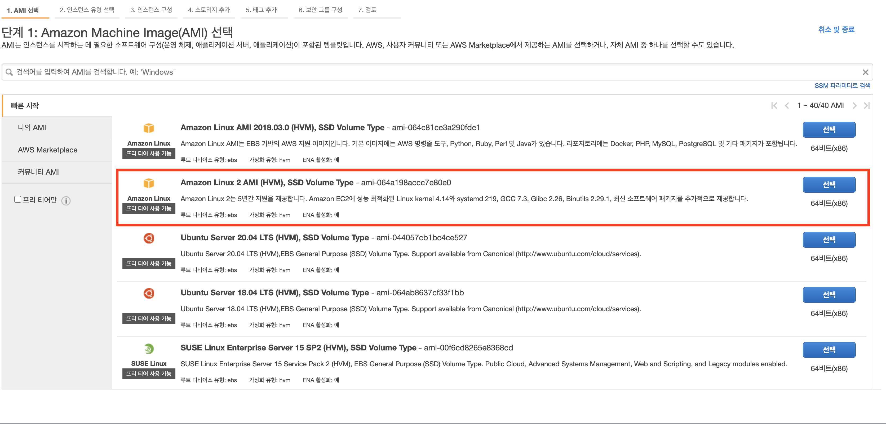
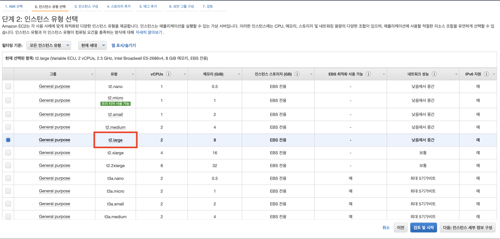
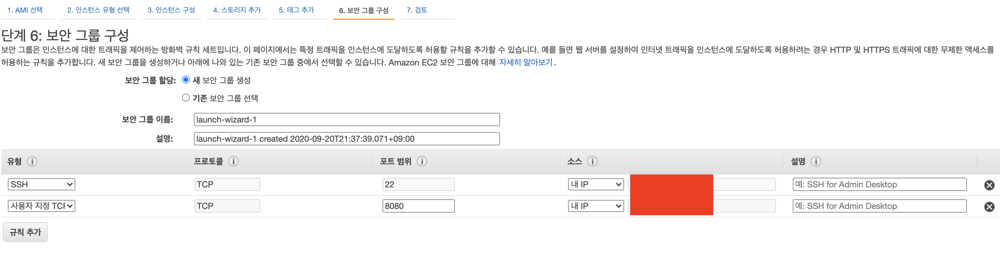
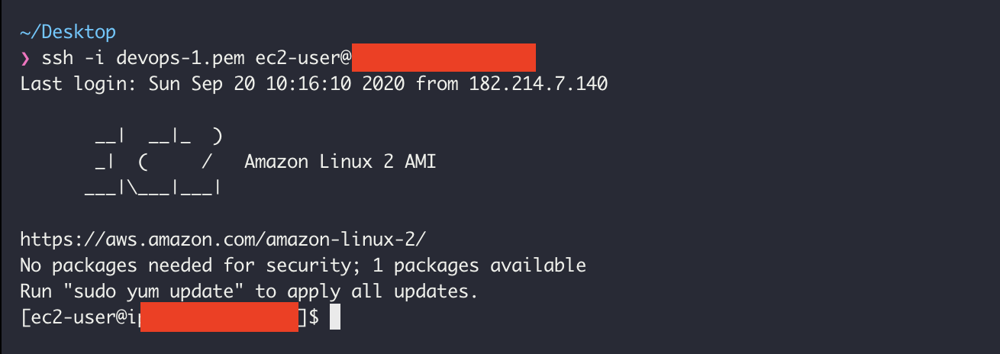
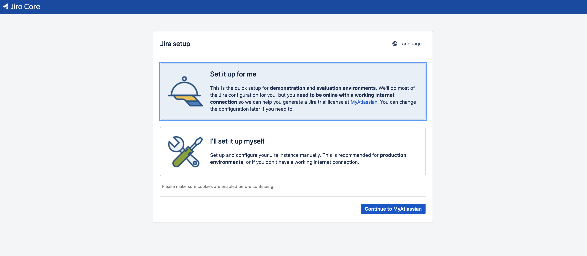
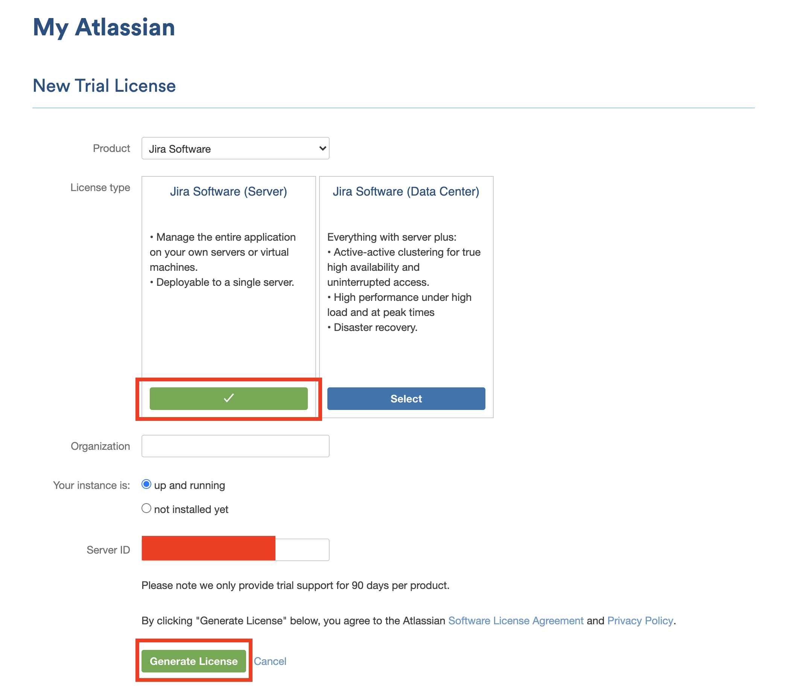
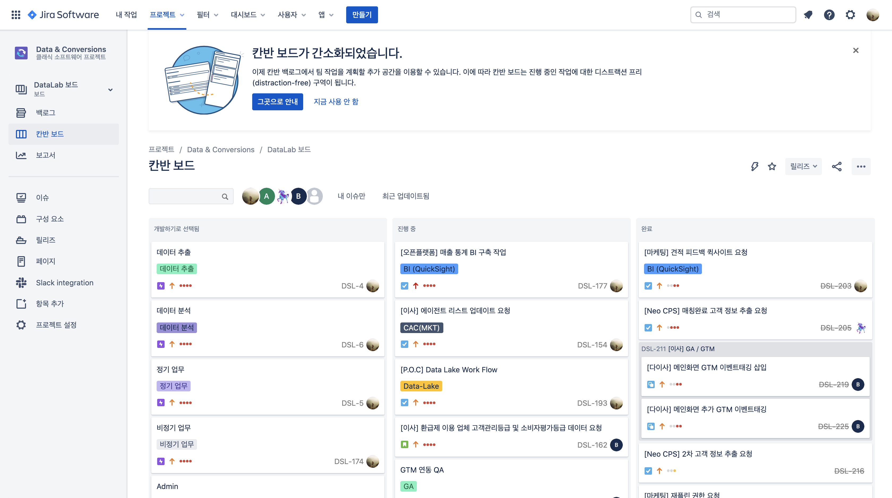

#### Jira란? [^1]

Jira란, 아틀라시안이 개발한 이슈추적 소프트웨어로 버그 추적, 이슈 추적, 프로젝트 관리 기능을 제공한다. 190개 국가에서 15만 명의 고객이 해당 서비스를 사용하고 있다 (2020.05 기준)
 

- - -

#### Jira의 필요성 

Jira는 특정 이슈를 누가 발견했는지, 누가 해결해야 하는지, 이슈는 현재 어떤 상태인지 파악하고 한눈에 해결 및 관리할 수 있다. 단순히 메일이나, 구두로 업무를 진행하는 것보다 한눈에 프로젝트 팀원들의 작업 현황을 확인하고 스케줄이나 우선순위를 조절할 수 있다는 장점이 있다.
 

- - -
#### 선택지 : AWS에 설치하는 이유
Jira는 Atlassian Cloud 혹은 직접 서버에서 운영하는 두 가지 형태로 서비스 사용 가능하다. Atlassian Cloud 에서의 서비스는 설치의 불편함을 최소화 하고 비용 또한 크게 절감할 수 있는 장점이 있다. 도메인-A Record 만 연결하면 ‘내 서비스’처럼 운영할 수 있기 때문에 좋은 선택이 될 수 있다. 하지만, Atlassian Cloud 는 한국에서 답답할 정도로 느리고, 커스터마이징에 제약이 따른다. 좀더 원활한 사용 목적에선 후자가 재격이다. 그래서 Amazon Web Serviced에 Jira를 설치하는 것을 설명하려고 한다.

- - -

#### 오늘의 목표
이러한 협업툴로 잘 알려져 있는 Jira를 AWS EC2에 Docker를 이용하여 Jira를 설치해보려고 한다.[^2]

- - -

#### 따라하기
##### Step 1. EC2 생성하기

1.1. Amazon Linux 2 AMI (HVM), SSD Volume Type 를 선택

1.2. t2.large 선택 : Jira는 메모리를 많이 사용하기 때문에 메모리가 조금 있는 t2.large로 생성한다(사용량에 따라 비용이 청구되기 때문에, 사용자가 적다면 그리 큰 비용이 청구되지 않을 것이다. 비용이 걱정된다면 예산의 한도를 정해놓고 그 이상을 넘으면 알람으로 메일로 받을 수 있다).

1.3. 보안그룹 설정 : 터미널 접속하기 위한 22번 포트와 웹으로 접속하기 위한 8080 포트를 열어줘야 한다.

1.4. ssh 접속할 pem key를 다운 받는다(분실하면 못 찾으니 잘 보관해야한다. 해당 키는 외부에 공개되면 안 되므로 git 디렉토리에 보관하면 안 된다).

 

##### Step 2. EC2 SSH 접속하기
> 작업 순서 : ssh 접속 -> docker 설치 -> jira 설치 -> docker 실행

2.1. 다운 받은 pem키로 ec2 ssh 접속한다.

> ssh -i \<your-pem-key> ec2-user@\<your-ip-address>

2.2. Docker 설치
> sudo yum install docker-io

2.3. Docker Daemon 실행
> sudo systemctl start docker

2.4. Docker Daemon (read, write)권한 부여
> sudo setfacl -m user:ec2-user:rw /var/run/docker.sock

2.5. Jira Docker 다운로드
> docker pull cptactionhank/atlassian-jira-software:latest
 
2.6. Jira Docker 생성
CATALINA_OPTS는 메모리를 설정해주는 옵션으로 2G를 잡고 설정했다.
> docker create --restart=no --name "jira-container" --publish "8080:8080" --volume "hostpath:/var/atlassian/jira" --env "CATALINA_OPTS=" cptactionhank/atlassian-jira-software:latest

2.7. Docker 실행
> docker start --attach "jira-container

2.8. Web 접속
인터넷 창을 실행한 후, AWS EC2의 Public IP:8080을 입력하여 접속한다.

Set it up for me를 선택 후, 초기 셋팅하여 Jira 협업툴을 사용하면 된다.

실제 필자의 회사에서 쓰는 예시 (개발 뿐만 아니라 다른 조직도 활발하게 쓰고 있다.)

[^1]: Jira에 대한 이해가 필요하다면 [Jira 소개글](https://reviewmaniac-00.tistory.com/43) 참고

[^2]: 본 글은 개발과 클라우드에 대한 지식을 어느정도 갖춘 상태라는 전제하에 작성하였다.
